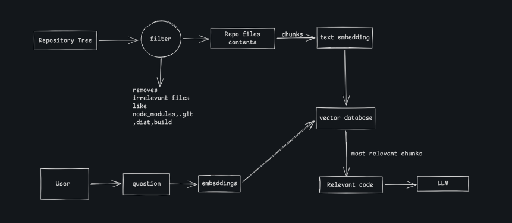

# Repo-Mind

AI-powered GitHub repository assistant that uses RAG to answer questions about a codebase using relevant source-code context.

## Tech Stack

- **Backend:** NestJS, TypeScript
- **LLM:** OpenAI API
- **Embeddings:** OpenAI `text-embedding-3-small`
- **Vector Database:** Supabase PostgreSQL + pgvector
- **Repository Data:** GitHub REST API

## How It Works

```text
GitHub Repository
       ↓
GitHub REST API
       ↓
File Extraction
       ↓
Code Chunking
       ↓
OpenAI Embeddings
       ↓
Supabase + pgvector
       ↓
Semantic Retrieval
       ↓
LLM
       ↓
Context-aware Answer
```

## Key Features

- Fetches source code from GitHub repositories.
- Filters irrelevant files and directories.
- Splits source code into overlapping chunks.
- Generates embeddings using OpenAI.
- Stores code chunks and embeddings in Supabase using pgvector.
- Retrieves relevant code using semantic similarity search.
- Uses retrieved code as context for LLM-generated answers.

## Architecture



## Project Structure

```text
src/
├── github/
├── ingestion/
├── ai/
├── rag/
├── repo/
└── main.ts
```

## Setup

```bash
git clone <repository-url>
cd repo-mind
npm install
```

Create a `.env` file:

```env
OPENAI_API_KEY=
SUPABASE_URL=
SUPABASE_KEY=
```

Run the development server:

```bash
npm run start:dev
```

## Current Status

- [x] GitHub repository/file extraction
- [x] Code chunking
- [x] OpenAI embeddings
- [x] Supabase pgvector storage
- [ ] Semantic retrieval
- [ ] LLM-powered repository Q&A
